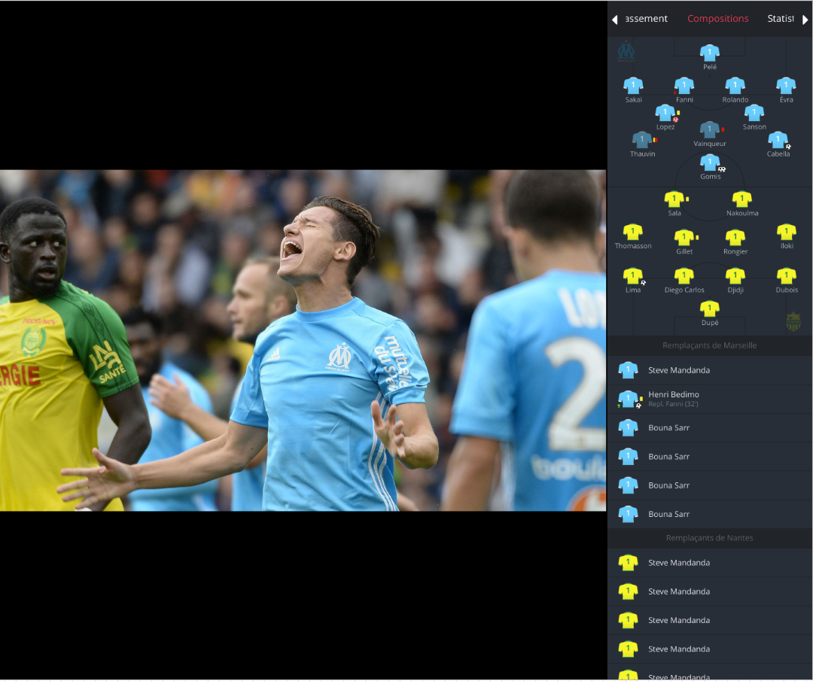
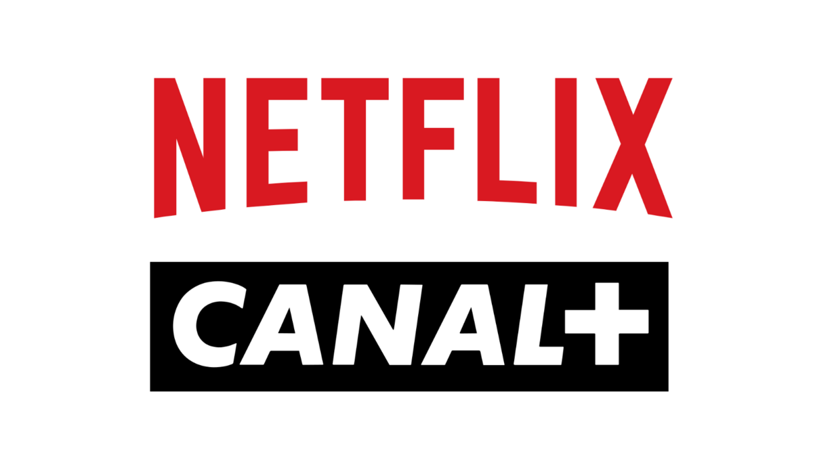
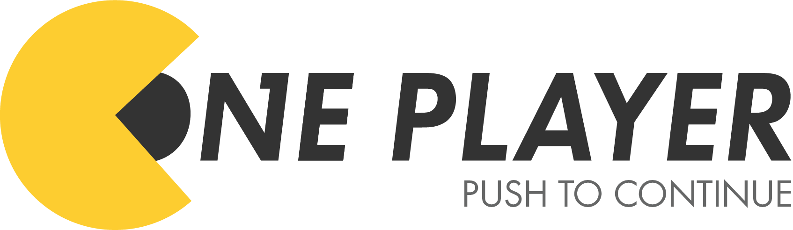

## Canal+, a media company.

CANAL+ is a french private television payable channel, focused on cinema and sport.

It was created in 1984, it's quite a long story now, but it also shows that they successfully self-reinvented and questioned what they were doing, being able to adapt themself to the market that is continually changing.

From the beginning of its activities, the technological innovation, the exceptional freedom of expression for the era, has contributed to consider Canal+ as a major actor of television.

The sports lovers, especially the football fans, have discovered a new way of filming at the time, they were putting the viewer like he was never before.
Canal+ possesses in his DNA the creation and innovation.

Canal+ soon became iconic of the french audiovisual, with over 5 million subscribers in France, more than 3 million that are a subscriber through ISP, and more than 20 million subscribers at the international.

However, they just have been caught up by Netflix in France in terms of the number of subscribers.

## Canal+'s life

When I first applied for Canal+, I was simply a student that wanted to explore the professional world.
I mean, I was delighted to come to a company like Canal+, but I was not expecting much from them. Still, as I said earlier, Canal+ has quite a long story now, I grew up with Canal+ at home, they were the pioneers of entertainment and the best in France when it comes to creating something new and trendy. This way of thinking played a major in the idea of applying here, in addition to that, they were searching for the new laborers of the 21st century, **developers**!.

However, I wasn't sure about the company once inside. I thought that if Canal+ was not a match with me, I could search for another job in Paris.
But I haven't thought much about it because I was going to work for a company that his main problem is to find the next entertainment for its customers.

From the first months, I was amazed by the level of motivation we wanted to put on the product. Everyone, at least in the Tech field, was pleased to work for a product like this.

Moreover, I was also surprised by the fact that we are in close collaboration with other big-tech companies like **Google**, **Sony**, or **Apple**. I mean, it's always fascinating and encouraging to work with these companies, you can learn so much from them.

It's also encouraging to work for a company whereas her main range of work is entertainment, there so few companies with problems like us for video on the internet. We have questions that not many people do have, but many people use video on the internet.
Building video content is expensive and tough!

Besides, the real work, there are also a few extra activities related to the company.
Almost, at least a day in a week, there is a cool event that permits us to see beyond our tech field and explore other possibilities given by the diversity of the type of jobs in the company.

One of them is the movie theater during lunchtime. It's refreshing to watch movies that are not out yet.

You also have the opportunity to meet many media persons but also artists. It's sporadic in companies to have these kinds of opportunities, I mean, I think we can count them easily.

We also have some great bonuses for entertaining. We got tickets for the Football match, tickets for a stand-up show and some others with serious price advantages.

## When tech meets media entertainment

The field is vibrant in terms of technological subjects.

Canal+ is covering a large perimeter of technological subjects because, we create and provide to the world our content by internet but also by a satellite connection, because all our subscribers didn't always have good access to the internet even in France in 2019.

To provide our content, for the subscriber's home, we also build the set-up boxes that permit us to receive content through the internet but also by satellite connection.

We also provide Live TV content and VOD content.

To stand out from our challenger, we try to create the entertainment of today and tomorrow.
To achieve that, we create interactive features to keep the user **active** rather than a **passive**.
To achieve that, we are continually adding features, such as the **Expert Mode**, that add extra pieces of information to a live sports event.
These pieces of information could be the highlights of a football game in case you missed a goal or even watch the differents angles of cameras for a formula one event, contributing to keeping the user **active**.

We recently added the **multi-live** feature that allows you to watch four different content at the same time. It's particularly useful to watch multiple sports events at the same time.
Up to you to configure how you want to watch your content, it gives you the possibility to focus if you're going to view a specific content or keep on the multi-view to not miss a thing.

However, these features added complexity for the user. He is no more passive, as I said earlier, but now active. It also added complexity to how we design our codebase because we have to deal with more data that could break and so be resilient with it.

Canal+ is smoothly creating an ecosystem around tech, by hosting meetups such as [Paris video tech](https://www.meetup.com/Paris-Video-Tech) or creating his meetup for Canal+ employees called **Canal tech** meetup.
They also help people to talk in public. It helps to get yourself improved to be able to speak in the conference, such as the [Devoxx](https://www.youtube.com/watch?v=Md3ktrlQ_H0) or even for the [Google I/O](https://youtu.be/Vo-UQDVykIs?t=1537).

## A streaming universe

As I said earlier, Canal+ successfully reinvented itself by putting innovation and technologies at first, and it's still the case, I mean, it's an exciting time to work for a streaming company nowadays, every day a new challenger knock on our door.
These competitors are not small but huge! It's **Netflix**, **Amazon**, **Apple**, and a lot of others.

Because, Canal+ is now turned on the streaming service as Netflix does, but we have more things to deal with. We are covering Live events (Sport, ceremonies, etc.), but also VOD content (Films, Tv shows, Series...).

Canal+ is also a content creator, every year, around 4 to 5 tv series are created and distributed on the streaming platform (**myCANAL**).
We are also an aggregator of content, which means that we are hosting other streaming platform services, for example in France, we have a platform owned by Orange called OCS that possess the right to broadcast HBO content in France, so we made a partnership with them to be able to broadcast their services on our platform.

More recently, we also made a partnership with Netflix and Disney+.
Thus, Canal+ is becoming a significant leader when it comes to entertainment in France, still in the logic to progress on the market by making partnerships instead of being a direct challenger.

However, the big companies that are launching their platform nowadays, such as Netflix, Apple, and Amazon, possess many more resources than us, but we have to compete with them, and that is exciting.
You have to implement the same features as them, but with fewer resources, it permits you to push yourself to your limit and gain knowledge quicker.

Because Netflix is becoming ultra mainstream and a standard in people's everyday life, and they ship a high-quality products. Thus, people are always comparing us with Netflix, because we are doing the same things as us, creating and distributing content through a subscription.

So, a certain minimum quality standard hit us because people will say _"On Netflix, they are doing like this, but in Canal, they aren't"_. But, I see this as a benefit for everyone, because natural competition is put in place, and then always push us forward to ship quality and innovate for our user but also surpass ourselves.

On the other hand, sometimes, it's unfair, not technically speaking the right in very country arent the same. In France, we have much more content protection video right than in other countries, so again the different actors of the sector possess here some advantages.

I see this as a football competition, you are supposed to be a less competitive team on the paper, but on the field, anything could happen, in most cases, the most prominent team win. Still, sometimes with obstinacy, humility, and work, you get some rewards, and this is that continue to keep waking me up every morning.

Also, because, for what I think, I prefer to work for something that is not the best but tries to be the best, instead of directly going for something that is at the top. It's like the game is already finished.

## Web Player Team

Concerning the web player, the unity where I'm working on, it's a team of around eight people, including seven developers and 1 Manager/Product owner.

We may think that eight peoples are a lot, but this project covers multiple complicated and specific topics.

We are maintaining two individual projects with one with **73 000** lines of codes and another one with **48 000** lines whose one relies on the other.

The one with **48 000** lines, is called the [**rx-player**](https://github.com/canalplus/rx-player), it's basically the low level abstraction of the [**HTML5 media element**](https://developer.mozilla.org/fr/docs/Web/API/HTMLMediaElement).

It uses under the hood the **MediaSource API** that permits to append video segment in a video element. You can check out these blogs post that explains it [here](https://medium.com/canal-tech/how-video-streaming-works-on-the-web-an-introduction-7919739f7e1) and [here](https://medium.com/canal-tech/when-web-video-streaming-takes-from-finance-4fecabae1156).

It's a complex project that relies on multiple technologies as FFmpeg, DASH-MPEG, Smooth, DRM, Adaptive bitrate streaming, and many others. It's also open-source, feel free to check it out [here](https://github.com/canalplus/rx-player).

The second one is called **One Player**. It's a private project, it's basically the UI of the player that integrates the **rx-player** and gathers all the canal's web services and where we made the interactions possible with the end-user.

For the last two years, both projects have grown in complexity because we are continually adding new features to create the next entertainment.

It would be wordy to list all the features integrated into the player overall, but feel free to try it on [canal+](https://www.canalplus.com/)!

But with complexity, some other problems like scaling projects architecture and keeping quality when doing features.

The projects are both delightful and are fantastic products. Every day I feel very excited to work on these projects because they are at the edge of streaming technologies. They are not restricted to desktop devices, but it's also possible to port our applications to embedded devices like **Chromecast**, **Playstation**, or set up **boxes**.

More and more challenges are coming, we will try to build the future of online entertaining in a streaming world.

If you liked the post and want to know more, or maybe ask me a question, feel free to write me a line on my email or Twitter :)
