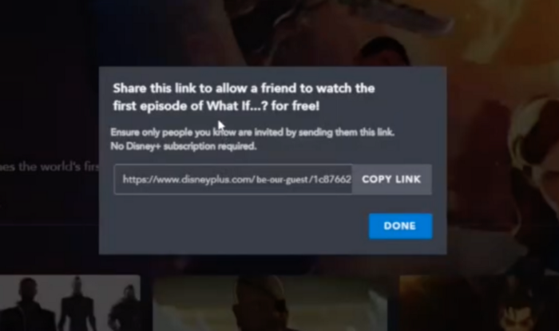

We recently had the opportunity to move things!
From zero to a project that could be integrated into the Canal+ ecosystem.

## Hackcelerator-as-a-service

What is the **Hack'celerator**?

The **Hack'celerator** is the intrapreneurship program of Canal+, that program allows every collaborator of the company, to submit his ideas in order to innovate in the group.

Everyone can participate no matter where he is coming from.

And now, what is an intrapreneur?

An intrapreneur is a person that will behave and act as an entrepreneur in an established company.

The idea behind those terms is to give a voice to collaborators, to them, to us, in order to bring fresh ideas.

The thing is that when a person works in the same domain for a long time even if he is an expert in his domains, he can be blind to what happens outside.

However, we know that there are many obstacles to becoming an intrapreneur because we are not controlling everything.

But, we cannot just pass by it because it's too hard to make it happen!

We have the opportunity to change things and it's open to all!

Let's go for it!

## Things that worked in the past

Looking in the past can help us understand things that happen in our present.

So I decided to see what worked in the past and it actually surprised me that many features would maybe never have been released or thought of without that kind of initiative.

I took the example of Gmail, It has been thought and built thank's to the 20% politics of Google. That 20% rule allows any collaborator to use 20% of his time dedicated to a side project during the working time.

I also discovered that the Facebook "Like" button, was also been thought of during an internal hackathon. It is now widely used when it comes to creating a system with social interaction.

Then, more recently I also find out that Disney+ has driven their hackathon that reunited more than 250 collaborators across 7 timezones. I decide here to speak about Disney+ because this is one of the first concurrent of Canal+.

It is crazy to think that those features are so being used, and they have been made during an exercise of intrapreneurship.

It shows how things can be moved! And I think the following quote from Darwin sum it all:

"It’s not the strongest that survives, it’s not the most intelligent that survives, it’s the one that adapts to change that survives."

## The Project, PushPlay

Here is the project I submitted for this exercise:

PushPlay provides a way to share content in the application itself.

I started from a simple state, is that video is the best way to create emotion. Emotion is important in people’s life. Therefore, people share content through social media or messaging app, but there is no way of sharing content in the app itself without going through a third-party sharer.

That’s why I wanted to add that kind of functionality.

The schema above, explains how I thought about a system where the users could share the content they love within the application.

Here what is going on, is basically, each user can create an open playlist where everyone can push the content they love in the playlist of their friends. By giving the possibility of doing so, it allows recommendation within the app without too much effort from both parties.

However, making a social feature within a streaming platform cost a lot but it also may not be the original goal, since a social platform is entirely dedicated to that.

So instead, I decided to start from functionality that already exists within the canal app and make it better by adding features on top of it.

This is the playlist feature, now users can add their favorite content already watched in the playlist and can decide to share it with the world thanks to a simple URL.

Thus, anyone that wants to watch content recommended by a friend can check that playlist.

That feature is not asking for too many resources, it respects the strategy of
[«fail fast»](https://www.entrepreneur.com/article/332961).

## A brief exposure on Disney 2021 hackathon

Disney recently organized a hackathon, under the theme « One dream, one stream, one team », which from Disney is the celebration, the tribute towards the goals, the history, and the collaborator that works to make Disney better every day.

I decided to talk about Disney+ here because it’s a direct concurrent of Canal+.

Disney+ reunited around 260 participants on 7 differents timezones and thought on more than 50 projects.

I’ve picked two projects that had my attention because it is directly related to the project PushPlay.

### Slide Disney+ Be our Guest

This project is partially answering the sharing problem of content when the person we want to share the content with is not a subscriber of the platform.

It allows creating a unique shareable code that can be consumed in order to play the content by the non-subscriber.

### Slide Disney+ Connect

This project goal once again wants to solve the problem of sharing content within the app itself rather than an external social media solution.

The solution here, rely on the visioning activities of the subscriber to create a kind of playlist out of it, to propose those contents to friends, family members, and social media.

We see that more and more projects rely on the social universe and on the sharing world. The video is the best way to vehiculate emotion. The emotion that we find in video content, we want to share with those we love.

## What we can expect

This is also the opportunity to learn a lot of things, like learning to build his ideas into concrete stuff.

The **Hack'celerator** will allow people to learn how:

- Testing the market
- Building a Business plan
- thinking about an MVP
- brainstorming
- learning about the entrepreneurial stuff as a whole
- getting out of his comfort zone

## What we cannot expect

The idea is not to code the project in a week but rather take time, around 6 months.

It allows taking our time to think about the project, to shift, rethink, and also validate the project idea.

The project has more chance to not go into production rather than to go into production.

This is hard to accept, but most of the time, the projects will not see the light of production. The **Hack'celerator** is also an opportunity to test things, without much pressure from a business perspective and like the life of an entrepreneur, the path is like a roller coaster.

## Taking the opportunities

The **Hack'celerator** is also full of opportunities to grow and to learn from others for ourselves.

We had the chance to visit [Station F](https://stationf.co/), which is the biggest startup incubator in Europe. It was a very rich experience since we were able to talk with a few entrepreneurs.

They give their insight, how did they jump into the entrepreneurial world, and answer a few people's questions about the uncertainty that entrepreneurship brings.

## Conclusion

However, after all the hard work, I was disappointed to know that the project won't go further for now.

Few reasons for this, but the main one, was caused by the huge roadmap, the product management decided to prioritize more business-oriented projects.

After all, this is the life of an entrepreneur. Failing is part of everything, helps us to see further and improve!

This 6 months experience is definitely worth it, if I had the opportunity, I would do again the 2022 version.

We learned so much in a domain that was unknown for the most. We got out of our comfort zone by pitching and by thinking about problems that only those kinds of initiatives can do!

I would to thank all the people that make it possible!

Fabienne, Anne, Thibault, Dorian and those who have participated...

Thank you!

