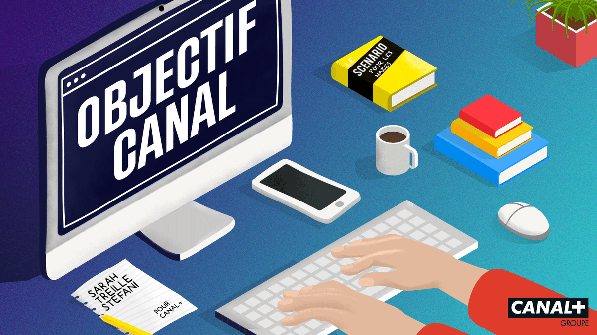

### How it started?

Once, a comedian came to us in relation to the Canal+ company in order to produce a podcast series.

The aims of this podcast were to promote our daily work and to explain to potential future listeners what is a typical meeting.

### The Speech

Sarah is a young director. She wrote a tv show and she absolutely wants to suggest it to Canal+.

Problem: She knows no one, and no one knows her! How she can get noticed? Sarah decides to infiltrate Canal+.

Her roommate, Melissa, who works for the company, helps her obtain her cup: an internship of observation!

Sarah is very happy! She will get in touch with the different professions of the company.

The best opportunity is to multiply the meetings until she finds the good person who will help her produce her tv show.

His first meeting takes place with the Tech Team. She tries to play the role of the perfect intern while getting as much as possible information for her tv-show.

### The podcast!

 
<iframe title="Embed Player" width="100%" height="188px" src="https://embed.acast.com/612f4a15a38d0b001af72416/614c93cd9de1aa001301e4ec" scrolling="no" frameBorder="0" style="border:none;overflow:hidden;"></iframe>
