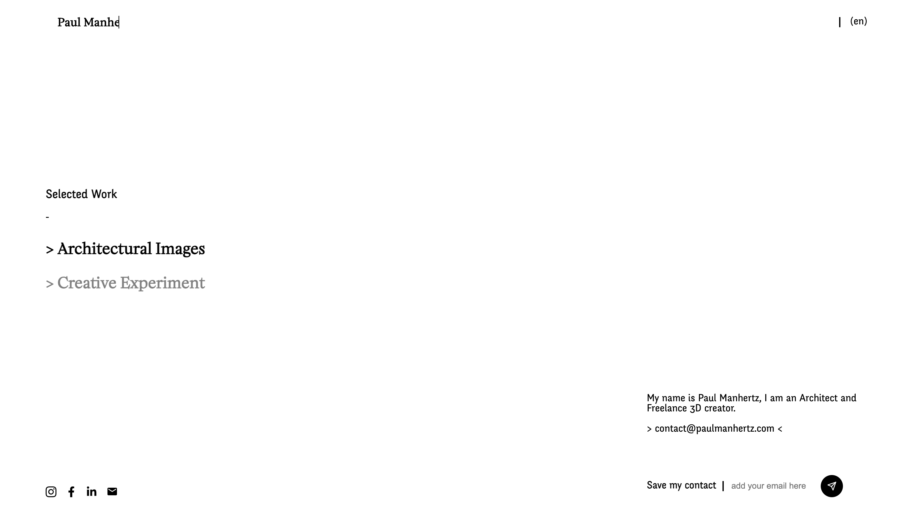

Here is a showcase website to present the projects from a 3D Creator and Architect.

It includes a Headless CMS backed by [Contentful](https://www.contentful.com/) and a front-end based on [NextJS](https://nextjs.org/).

- https://paulmanhertz.com/

