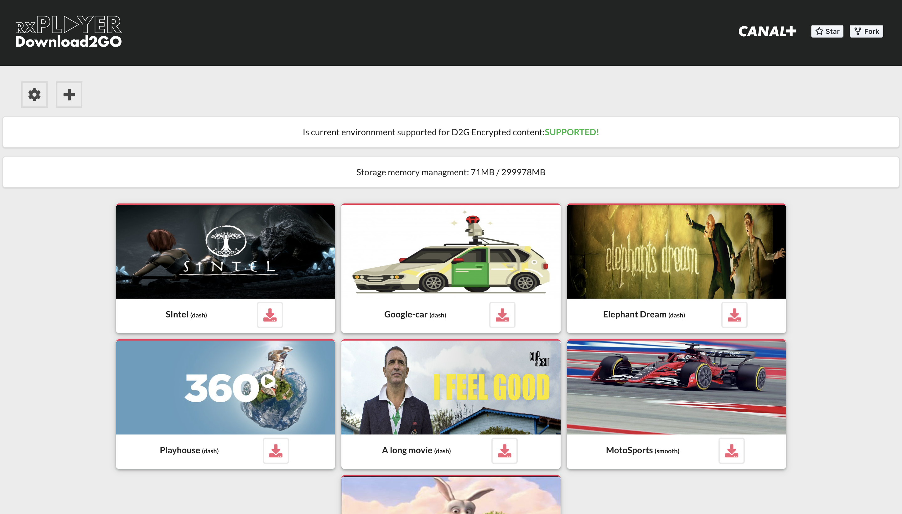

During my time at Canal+, I created a library tool to download the video online to consume it offline.

It's a trendy feature when it comes to watching movies in an environment where internet connection access is an issue, like a train or airplane.

It already exists in Netflix, Disney+, and other prominent streaming actors, on iOS and Android devices, but it has never existed in the browser.

It uses an exposed API from the [rx-player](https://github.com/canalplus/rx-player) and rely on [IndexedDB](https://developer.mozilla.org/en-US/docs/Web/API/IndexedDB_API) to store video segments in the browser.

- https://d2g-canalplus.paulrossethings.com/

