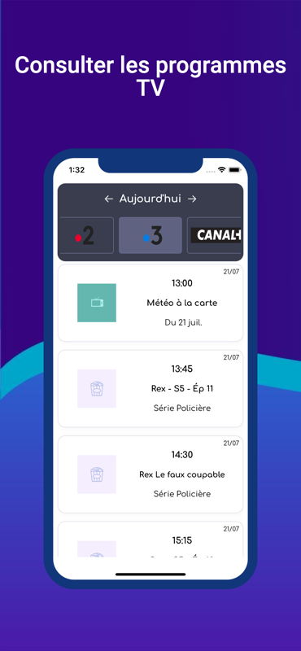

Here is a small iOS app that lets people quickly check the TV schedule for the current days, upcoming days, and past days. It's also possible to create a reminder when a future program begins under the form of a notification.

It concerns only the **french** market.

The App has been made thanks to the Swift programming language and UIKit.

Only available on iOS devices.

- [DayTv on the App Store 🍏](https://apps.apple.com/fr/app/daytv/id1515950680)

|                      |                              |                              |                              |                              |
| -------------------- | ---------------------------- | ---------------------------- | ---------------------------- | ---------------------------- |
|  | .png>) | .png>) | .png>) | .png>) |
