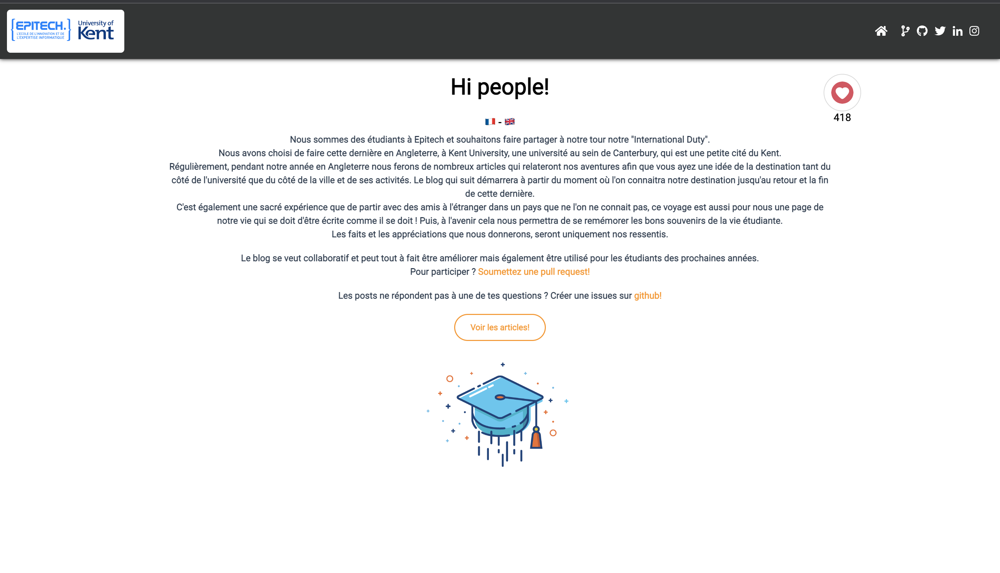

I spent an entire year from September 2017 to September 2018 at Kent University, an English university close to London, where I studied Computer Science.

It was an exchange between Epitech school and Kent University, where I had the chance to discover a new culture.

During that year, I created a blog where I was writing all the things that came to my mind that year for the following students that would come after me to discover everything around a year abroad in the best way possible.

Unfortunately, for now, the blog is only in french. I will translate it one day into English as well.

This blog is backed by [Gatsby framework](https://www.gatsbyjs.com/)

- https://epikent.paulrossethings.com/

