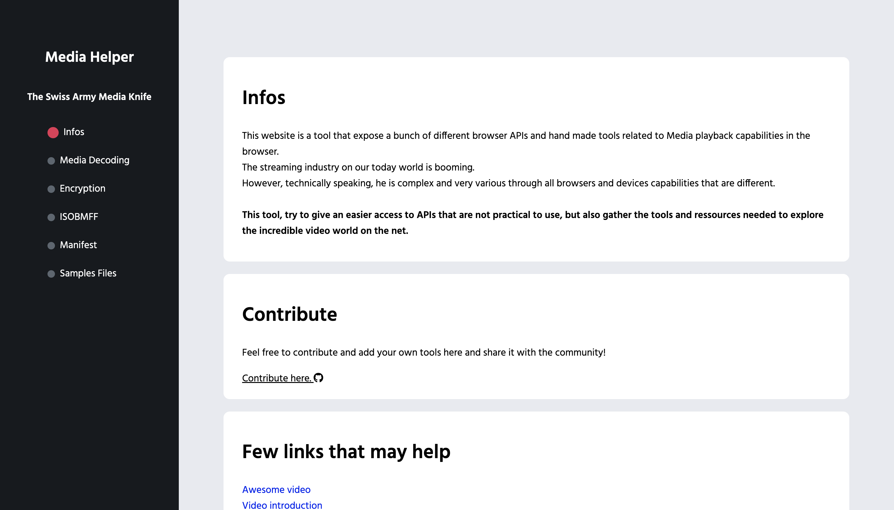

At Canal+, I worked every day in a video environment. We were dealing every day with a problem that not many companies have caused video on the web is costly.

During that time, I tried to gather all the issues of development and debugging.

From those findings and information gathering, I created a tool that would allow people to gain time debugging and understanding this complex video environment.

Hence is born the tools: Media helper, which gathers into a single tool all the APIs a video application could use to distribute video on the web.

- https://mediahelper.vercel.app/
- [Blog article](/technical-writing/technical-writing/mediahelper-io/)

