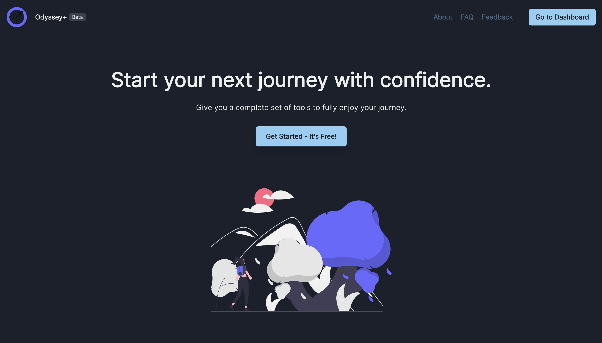

Many people love traveling around the world and discovering a new culture.

But going abroad come with a lot of preparation and stress, as people travel to unknown places.

The following tools help travelers organize by having a range of tools to manage their trips and thus leave some stress aside.

The website is developed thanks to [NextJS](https://nextjs.org/) and the back-end is made thanks to [Supabase](https://supabase.com/), an open source alternative to Firebase.

- https://www.odyssey-plus.com/

