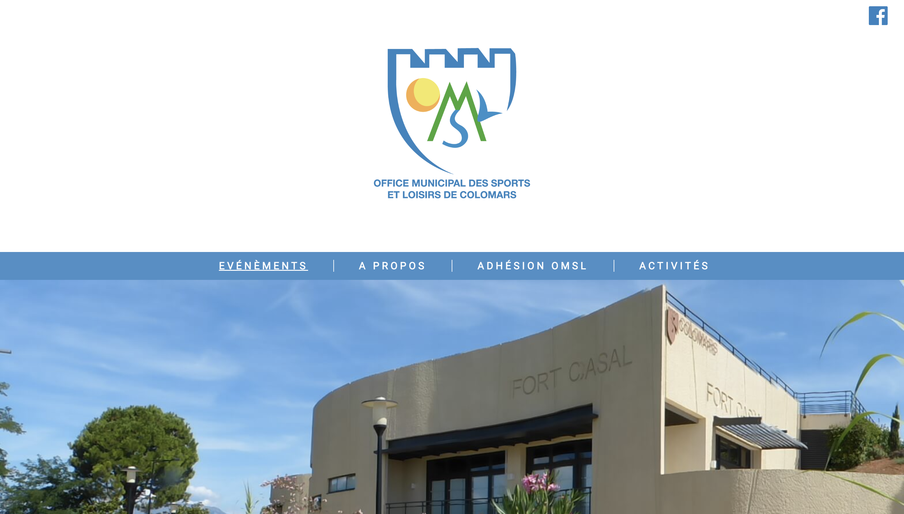

Here is a website toward a small sport association that I made.

It includes a Headless CMS backed by [Strapi](https://strapi.io/) and a front-end based on [NextJS](https://nextjs.org/).

- https://omsl-colomars.fr/

