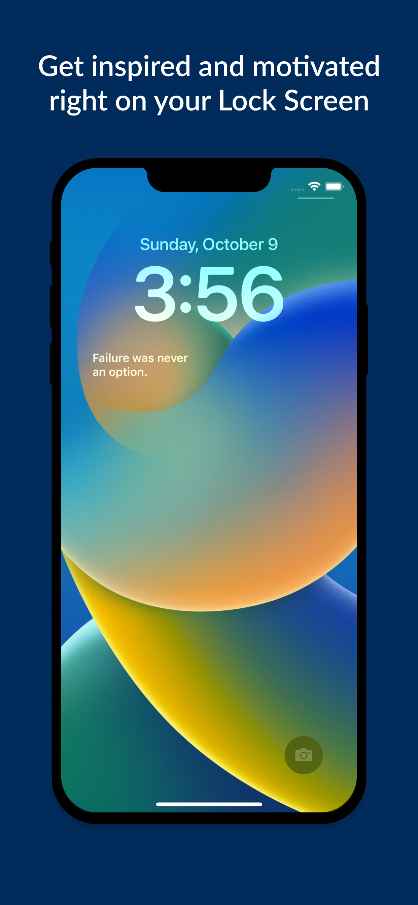

Choose a range of quote families and set up your widget on the lock screen or the home screen.

Widgets will display a quote from the family quote you chose in the app to get you motivated and positive throughout the day.

The quote is changing every day.

Don't hesitate to contact me if you want to add another quote family to the list.

The App has been made thanks to the Swift programming language, SwiftUI and WidgetKit.

Only available on iOS devices.

- [Quote Widgets on the App Store 🍏](https://apps.apple.com/fr/app/quote-widgets/id6443703993)

|                        |                              |                              |                              |                              |
| ---------------------- | ---------------------------- | ---------------------------- | ---------------------------- | ---------------------------- |
|  | .png>) | .png>) | .png>) | .png>) |
