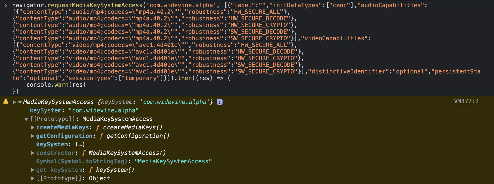

Since the beginning of video on the internet, it has always been a challenge to protect video copyright from not being distributed illegally.

From music to books or movies, we can still find pirated copies we can consume on the internet. Audio and video assets have flooded the internet for a few years.
Netflix, HBO, Disney, Amazon, Spotify, and others uploaded hours and hours of content to watch and listen to.

But many of the contents uploaded are protected by their authors also named copyright. Those contents are encrypted thanks to cryptographic technologies to avoid being played without the right to do so. Hence, to play it, the user first will have to prove that he is allowed to do so by presenting proof that he is paying to watch it.

Few standards have emerged to address the problem of distributing protected content on the internet, so the term Digital Right Management (DRM) came in.

## Content Decryption Module (CDM)

Nothing would be possible with the Content decryption module. The CDM is a piece of proprietary software used to decrypt video content that is encrypted thanks to a key.

A CDM is integrated into almost all majors browser such as Safari, Chrome, and Firefox.

However, depending on the browser, you can find different kinds of CDM.

For instance, Safari uses a CDM named Fairplay on every Apple device. Apple has created Fairplay.

But the most common one is Widevine. You will find it inside Firefox, Chrome, Microsoft Edge, and many other setup boxes like Chromecast.

Some others are less used, like Playready from Microsoft or Nagra.

For example, the Playstation 5 uses Playready as CDM, but Microsoft Edge also implemented Playready and Widevine. For Widevine, you can check the following URL to see in which devices the CDM is implemented:

- [https://developers.google.com/widevine/drm/overview](https://developers.google.com/widevine/drm/overview)

The CDM is basically like a black box; the lesser we know how it works, the better it is for keeping the CDM safe from potential hackers.

The level of protection the CDM offers is closely related to the hardware. Indeed we can take the example of Widevine, which offers three levels of protection depending on the hardware you have:

- Widevine L1 ⇒ Highest level of protection, media, and cryptography operations occurs in a trusted execution environment (TEE).
- Widevine L2 ⇒ Only cryptography operations are executed in a TEE, not media processing.
- Widevine L3 ⇒ Software-based DRM only.

When a company like Google with the Chromebook or Apple with the Macbooks or iPhones owns the whole line from the hardware to the software, it allows for having a more robust level of protection as TEEs are implemented.

However, the CDM is not only the single piece of the puzzle to make it work the entire process. We also need a server that will distribute the key that the CDM will use to decrypt the content.

In the next section, we will see how the Encrypted Media Extension API is used to orchestrate the exchange between the server that distributes the keys and the CDM that decrypt the video content.

## Encrypted Media Extension

EME is an API available in most browsers that follow a [W3C standard](https://www.w3.org/TR/encrypted-media/) that allow the client to play encrypted audio and video content without using additional plugins.

### The first building block

Let’s enter the API. Everything starts from the method: `requestMediaKeySystemAccess` bound to the navigator object in the browser, the call to this method is the mandatory first step to decipher the video content.
It’s a way for us to ask what configuration is available, given a specific content decryption module. For instance, it allows asking for a very strict configuration that respects a high level of security because our content is very sensible but also can only serve standard quality when the guarantee on the device is too low.

```
requestMediaKeySystemAccess(keySystem, supportedConfigurations);
```

It waits as a first parameter, a `keySystem` string that allows us to identify what kind of CDM you want to use for the current session. For instance, if we want to use Widevine as CDM, it would be `com.widevine.alpha`.
At the following URL, some of the most used `keySystem` are shown:

- [https://mediahelper.vercel.app/encryption#simpleKeySystems](https://mediahelper.vercel.app/encryption#simpleKeySystems)

Then, it accepts a second parameter, a possible configuration you may want to use for deciphering video/audio content. Specifying a configuration helps to know what level of security the device you will play on supports. You can check the following URL to uncover what parameters the configuration is waiting for:

- [https://mediahelper.vercel.app/encryption#advancedKeySystems](https://mediahelper.vercel.app/encryption#advancedKeySystems)

The method returns a `promise` that will either resolve with the supported CDM configuration if there are any or rejects if no configuration asked on the current device is supported.

### MediaKeySystemAccess interface



The first step is over. We detected that an existing configuration that suits our needs is available, so we can use that configuration returned by the `requestMediaKeySystemAccess` to go further.

```
interface MediaKeySystemAccess {
    readonly attributeDOMStringkeySystem;
    MediaKeySystemConfigurationgetConfiguration();
    Promise<MediaKeys>createMediaKeys();
};
```

Indeed, that previous method is returning a `MediaKeySystemAccess` interface that will be our go-to to exchange data between the server and the CDM.

### Creating the MediaKeys

To start, we would need to create a MediaKeys instance that represents a set of keys that an associated HTMLMediaElement can use for decryption.

We can create a MediaKeys instance thanks to the method present on the `MediaKeySystemAccess` interface we currently have.

```
const mediaKey = await mediaKeySystemAccess.createMediaKeys();
```

It returns a promise with the new `MediaKey` created.

Once we have created the media key, we can first attach this media key to the VideoElement like so:

```
video.setMediaKeys(mediaKeys);
```

Doing that will tell the video element that we will use that media key instance to decipher the content.
A `MediaKey` represents a CDM instance. A `MediaKey` has the following interface:

```
interface MediaKeys {
    MediaKeySession  createSession(optional MediaKeySessionType sessionType = "temporary");
    Promise<boolean> setServerCertificate(BufferSource serverCertificate);
};
```

On the one hand, we have the `setServerCertificate` method that permits encrypting messages sent between the license/key server and the CDM. That method is not mandatory but would help avoid an additional round trip of exchange between the license server that contains the keys used to decipher and the content decryption module (CDM).

On the other hand, the `createSession` method is mandatory to continue our journey to decipher the video to be playable in the browser.

The `createSession` method takes a parameter that will tell if the current session of deciphering would be temporary or persistent. Indeed, some licenses distributed by the server could contain persistent keys that the CDM can reuse for later usage. The CDM store those reusable keys in safe local storage on the machine. However, this feature requires a higher level of security from the device as it’s a lot more sensitive since we store the key on our machine. Persistent licenses are often used to consume the content offline or for performance purposes to avoid retrieving the licenses containing the keys again.

### MediaKeySessions

As you may understand, we need to create a new `MediaKeySession` to decrypt the content. We can do that by invoking the method as follow:

```
const mediaKeySession = mediaKey.createSession("temporary");
```

It returns a `MediaKeySession` with an interface richer than we saw before:

```
interface MediaKeySession :EventTarget {
    readonly attribute DOMStringsessionId;
    readonly attribute unrestricted doubleexpiration;
    readonly attribute Promise<void>closed;
    readonly attribute MediaKeyStatusMapkeyStatuses;
             attribute EventHandleronkeystatuseschange;
             attribute EventHandleronmessage;
    Promise<void>generateRequest(DOMStringinitDataType,
                                     BufferSourceinitData);
    Promise<boolean>load(DOMStringsessionId);
    Promise<void>update(BufferSourceresponse);
    Promise<void>close();
    Promise<void>remove();
};
```

We will be more specifically interested in the `generateRequest` method used to generate a challenge that will be sent to the license server. A challenge is raw binary data containing information on how to decipher the content. We then need to transmit that challenge to the license server that will be able to answer with a license containing the necessary keys to decrypt the video content.

Hence, to ask the CDM to generate a challenge, we will use the `generateRequest` method as follow:

```
await mediaKey.generateRequest(initDataType, initData);
```

It takes two parameters; the first is the encryption schema we should use; most of the time, it will be: `cenc` for common encryption. Then the second would be the initialization data, a generic term for container-specific data used by a CDM to generate a license request.
To get the `initData`, we would need to listen to the `onencrypted` event from the video element ([`HTMLMediaElement.onencrypted`](https://developer.mozilla.org/en-US/docs/Web/API/HTMLMediaElement)). Indeed, as soon as the video receives the first video segment in the buffer if the video segment is encrypted, this event will fire with the `initDataType` and the `initData` needed.

### Listening to events when the CDM is ready and pushing the license to the CDM

Once we call `generateRequest` method, we would need to wait for the challenge to be produced by the CDM. To achieve this, we can listen to a specific event on the `mediaKeySession` we created earlier:

```
mediaKeySession.addEventListener("message", (event) => {
  const challenge = event.message;
  const xhr = new XMLHttpRequest();
  xhr.open("POST", LICENSE_SERVER_URL, true);
  xhr.onerror = (err) => {
    reject(err);
  };
  xhr.onload = (evt) => {
    if (xhr.status >= 200 && xhr.status < 300) {
      const license = evt.target.response;
      resolve(license);
    } else {
      const error = new Error(
        "getLicense's request finished with a " + `${xhr.status} HTTP error`
      );
      reject(error);
    }
  };
  xhr.responseType = "arraybuffer";
  xhr.send(challenge);
});
```

The challenge is under a form of binary content: `Uint8Array`.
We need to send that data to the license server through a POST request. The license server should answer us with a license containing the keys to decipher the video content.

If everything goes well and the server gives back the license, we need to give the license to the CDM by using the `update` method on `MediaKeySession`.

```
await mediaKeySession.update(license);
```

The license is also binary type data.
If the CDM accepts the license, the video element will change its `readyState` to ready, and the browser will play the video in the browser through the video element.

This is a simplified version of how the different steps should be achieved, but many events can happen between the start to the finish. I strongly recommend reading the entire spec from the W3C to build a fully working piece that is compliant with the standard.

- [https://www.w3.org/TR/encrypted-media/](https://www.w3.org/TR/encrypted-media/)

## Conclusion

With the growth of the streaming universe, companies like Netflix, Disney+, and Amazon put tremendous dedication into creating video content. They expect, in return, paid subscriptions from the users to consume the content. Those companies need to protect their creation from hackers that could distribute movies, series, or music for free on the internet. A solution to this issue is encrypted content; EME allows the deciphering for paid subscribers.

However, encrypted content doesn't mean that it's unbreakable. Some levels of security are known to have been broken in the past. For instance, the lowest level of protection, Widevine, L3, has been broken, as demonstrated on the following [website](https://www.hacking.land/2020/10/widevine-l3-decryptor-chrome-extension.html). Since the movie's right owner can't fully trust some CDM security levels, they decided to restrain the deciphered quality to a certain level. Indeed, for example, if you don't qualify for the security restriction they put in place, you will be able to the video but only at a standard quality (720p) at a maximum.

Finally, we can say that the less the device is open in terms of software and hardware, the more you will be able to play high-quality video content because it’s harder for an attacker to find an attack surface.

For instance, you will have more chances to play high-quality video content on your next streaming session on Apple’s devices coupled with Safari browsers.

However, since the beginning of the protected content, there was always a debate regarding the DRM (digital right management) as it’s against the philosophy of open-source, as it’s become tough to develop open-source browsers and include EME standards.

I hope that you enjoyed this first introduction to EME API.

Thanks.
