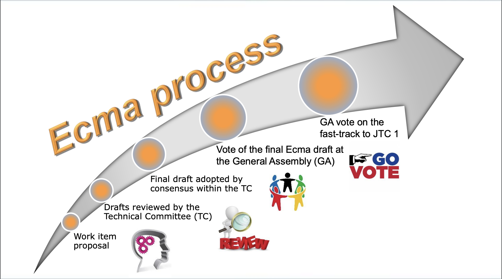

Javascript is one of the fastest evolutive programming languages out there. Few features are shipped every year to make the language more pleasant to use.

But have you ever heard of how those features arrive directly in your browser?

To become a part of the javascript standard, all of the features of javascript have followed a strict path.

This article will go through the conception path of a javascript feature, from the thinking phase to the conception phase, until it reaches your browser.

## Ecma

The world needs standardization.

A standard is a piece of technical writing that defines rules, conditions, guidelines, or characteristics that anyone can refer to implement a solution.

For instance, an operating system, to give access to the internet to the computer, has to develop a piece of software capable of doing that; it must follow the TCP/IP Network Standard.

What would have happened if no standard existed and every operating system had to write its custom implementation of network software?

Without those standards, it would be challenging for everyone to communicate easily as no one would allow information to be easily shared. It can be seen as language communication, how to communicate with someone that doesn’t speak the same language as me.

The standards have been part of the internet for many years. The ECMA, initially the European Computer Manufacturers Association organization, was created to address standards in the computer hardware industry in 1961.

In 1994, with the increasing success of the organization, they renamed it simply Ecma with small letters. The reason for that change was to signal that they were changing the original mission of the association by becoming international first and then by operating on more diverse standardization topics like software, hardware, communications, media, storage, and more.

## TC39

TC39 is a technical committee composed of industry experts formed by Ecma to address multiple tasks regarding ECMAScript, the Javascript standard; their work consists of:

1. Maintaining and updating the ECMAScript*®* programming language standard.
2. Identifying, developing, and maintaining standards for libraries that extend the capabilities of ECMAScript*®*.
3. To build test suites to verify the correct implementation of these standards.
4. Contributing to selected standards of [ISO/IEC JTC 1](https://www.iso.org/about-us.html).
5. Evaluate and consider proposals for complementary or additional technologies.

TC39 meet multiple time a year to discuss ongoing topics and future possibilities.

Here is an excellent video from a JSConf in 2018 that present the work of the TC39 committee.

[](https://youtu.be/Hj5q8uyqGYc)

- https://youtu.be/Hj5q8uyqGYc

## Proposals

An Ecma technical committee is organized so that a feature should pass 5 (stages 0,1,2,3,4) different stages before going live in the standard.



This chapter will discuss each stage, its objectives, and its work.

### Stage 0

The first stage is open to everyone, there are no entrance criteria, so it means that anyone can submit a discussion, idea, or proposal for a change or addition.

This stage is considered a “straw person” stage; a straw person is a philosophic term used when the weakest version of an argument is attacked while stronger ones are ignored.

In order to make the process smoother, some work is required to create a feature request.
You should document the problem and sketch a solution with other community members, including TC39 members.

Your role is to convince a TC39 champion, a TC39 core member, to agree that the feature you propose is helpful to add it to the standard.

Once you have convinced a TC39 champion, that person will present the proposal to a TC39 meeting that occurs six times a year to determine whether to move the proposal to the next stage or not.

You can find the agenda of the TC39 meeting right [here](https://github.com/tc39/agendas/).

Here is also an example of what a TC39 stage 0 proposal should look like:

- https://github.com/Kingwl/proposal-string-trim-characters
- https://github.com/tc39/template-for-proposals

In this stage 0 proposal, a developer asked to enhance the trim method already implemented in ECMAScript so she could take in parameter a string of characters to remove rather than removing whitespaces:

```
const nickname = "-_-abc-_-";
nickname.trim("_-");
// => 'abc'
```

As well as this, many of the features being requested already have a solid track record.

For example, the proposal above is already implemented in a famous library named [Lodash](https://lodash.com/docs/4.17.15#trim).

Consequently, the developers would like to add it to the standard to eliminate the need to download and install a dependency and contribute to the ECMAScript standard by continuously improving it because they found it as an actual use case in a typical developer flow.

### Stage 1

Stage 1 and upcoming stages are considered “maturity” stages, where the TC39 team will challenge and harden the solution.

Step 1 proposals represent problems for which the committee wishes to explore solutions.

It has multiple purposes:

- Arguing why the committee should add the feature to ECMAScript.
- Describe the shape of a solution
- Identify potential challenges

For the proposal to enter Stage 1, multiples criteria have to be provided by the proposal like:

- Identified “champion” who will advance the addition
- Prose outlining the problem or need and the general shape of a solution
- Illustrative examples of usage
- High-level API
- Discussion of key algorithms, abstractions, and semantics
- Identification of potential “cross-cutting” concerns and implementation challenges/complexity
- A publicly available repository for the proposal that captures the above requirements

While each stage is an opportunity to challenge the proposal, the committee can, at any given time during the process, downgrade the proposal at an earlier stage if an unexpected specific point is raised that is blocking and should have been spotted earlier.

At each stage, the committee must reach a consensus to move forward. To achieve that consensus, the committee can give the TC champion constraint in order to move forward.

### Stage 2

Stage 2 aims to describe the syntax and semantics using formal spec language precisely.

It also marks a significant milestone, as passing from stage 1 to stage 2 means a lot for the future of the proposals, as the official document says: “The committee expects the feature to be developed and eventually included in the standard.”

Hence, passing stage 2 almost means that the committee will include the proposal in the standard if no hardpoint is encountered, but work remains to accomplish.

For the feature to enter stage 2, an initial spec text should be given and, of course, all the requirements to enter stage 1.

The committee is also choosing reviewers for acceptance; the reviewers must give their approvals before a proposal enters stage 3, and all TC39 participants should approve the design of proposals they care about before granting stage 3 consensus.

Stage 3 allows the committee to indicate that further refinement will require feedback from implementations and users.

To reach that stage, the committee expects a complete spec text that has been reviewed and signed by designated reviewers and all ECMAScript editors.

It’s also asked to write a conformance test suite that is an ECMAScript standard to ensure that the proposal is technically safe to implement; those tests are [https://github.com/tc39/test262/](https://github.com/tc39/test262/).

Here is what a test could look like:

```
/*---
description: Should not test in sloppy mode
flags: [onlyStrict]
negative:
  phase: runtime
  type: ReferenceError
expected:
  pass: true
---*/
x = 5;
$ERROR('Not in strict mode');
```

Accepting that stage means the solution is complete, and no further work is possible without implementation experience, significant usage, and external feedback.

When the consensus is reached at that stage, the solution is complete.

### Stage 4

The last step of a long journey, stage 4, indicates that the addition is ready for inclusion in the formal ECMAScript standard.

It means that few acceptance tests for mainline usage have been written, but two implementations of the feature have also been developed, and the acceptance tests should pass on them. Finally, a pull request has been sent to [tc39/ecma262](https://github.com/tc39/ecma262) with the integrated spec text, and all ECMAScript members have approved the pull request.

The proposal will be included in the soonest practical standard revision when all the checks above are filled.

## Javascript Core engines

Once the proposal has been approved and merged into the official standard, other actors in the javascript world can safely implement the proposal into the piece of software they maintain without expecting rework and hence make available the feature to other developers.

For example, [V8](https://v8.dev/), the most used javascript core engine that backs [Chromium](https://www.chromium.org/chromium-projects/) or [Node.js](https://nodejs.org/en/), will adopt the proposal safely to distribute it to everyone without dependencies while following the standards written.

## Babel

As we saw, the time between stage 0 and stage 4 can be very long, and many things can happen during the whole process, so it means that for a feature to be merged into the standards, it could take several years, as major actors like [V8](https://v8.dev/) or [SpiderMonkey](https://spidermonkey.dev/) (Firefox JS Engine) will wait for the proposal to be merged in the ECMAScript standard.

Most of the time, developers would not wait for the proposal to be merged, but instead, rely on very practical tools named [Babel](https://babeljs.io/), a Javascript compiler that lets us power up the language semantics without waiting for the standard to validate the feature.

[Babel](https://babeljs.io/) allows any developer to enhance their Javascript workflow by adding features to the language that are not available natively yet.

For instance, the [bind function syntax proposal stage-0](https://github.com/tc39/proposal-bind-operator) is available as a [Babel plugin](https://babeljs.io/docs/en/babel-plugin-proposal-function-bind) if we want to use the feature immediately, without waiting for the proposal to be validated to the standard.

```
obj::func;
// is equivalent to:
func.bind(obj);
```

When [Babel](https://babeljs.io/) came, it was a significant change for all developers as it changed the ecosystem around Javascript.

## Conclusion

Standards are the building block of the internet world we live in.

They are essential to the tech as they permit not to reinvent the wheel each time; developers rely on those standards to build other pieces of technologies on top of it.

Trusting and relying on those standards is crucial.

I like taking **Isaac Newton’s** quote, a famous scientist because it illustrates the situation here well.

- “**If I have seen further, it is by standing on the shoulders of giants.**”

Here, Isaac Newton uses a metaphor to illustrate that he used the understanding his predecessors gained to make intellectual progress.

Without noticing it, in our daily life, we rely on **Internet Standard** that rules worldwide communications.

Standardization is helping the world maximize compatibility, interoperability, safety, repeatability, and quality.

## Resources

- [https://github.com/tc39/ecma262/blob/HEAD/CONTRIBUTING.md](https://github.com/tc39/ecma262/blob/HEAD/CONTRIBUTING.md)
- [https://tc39.es/process-document/](https://tc39.es/process-document/)
- [https://github.com/tc39/how-we-work/blob/HEAD/matrix-guide.md](https://github.com/tc39/how-we-work/blob/HEAD/matrix-guide.md)
- [https://es.discourse.group/](https://es.discourse.group/)
- [https://github.com/tc39/proposals/](https://github.com/tc39/proposals/)
- [https://github.com/tc39/agendas/blob/main/2022/07.md](https://github.com/tc39/agendas/blob/main/2022/07.md)
- [http://www.sis.pitt.edu/mbsclass/standards/viar/TCP-IP.html#:~:text=The protocols in the TCP,by the Network Information Center](http://www.sis.pitt.edu/mbsclass/standards/viar/TCP-IP.html#:~:text=The%20protocols%20in%20the%20TCP,by%20the%20Network%20Information%20Center).
- [https://www.ecma-international.org/technical-committees/tc39/?tab=activities](https://www.ecma-international.org/technical-committees/tc39/?tab=activities)
