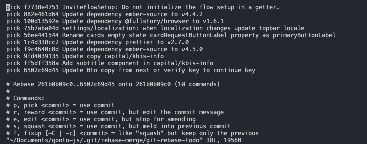
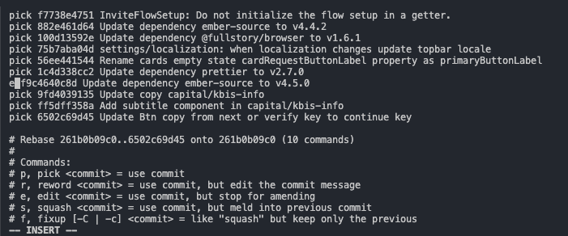
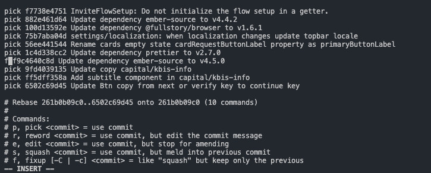
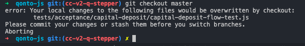

Git is essential to every programmer out there. It’s a version control system that tracks any set of files.

Every programming team in the professional world is using Git. There is almost no serious challenger out here.

It’s crazy to think that the person that developed Git back in the days (2005) has also created Linux. This person is **[Linus Torvalds](https://www.ted.com/talks/linus_torvalds_the_mind_behind_linux).**

In this article, here are some of the commands I use daily that allow me to keep productive while managing code.

## Resetting

The `git reset` command is used to reset the `HEAD` to a specific state.
In this part, we will see a few ways to use it to achieve particular items.

### Hard

```
-> git:(upgrade_react) $ git reset --hard origin/master
```

The `reset` command, used with the `--hard` option, is a destructive operation that will rewrite the git history, so you must first be extremely careful when using it.
However, `reset --hard` can become very handy if you know what you are doing.

To put your mind at ease until you don’t push the changes to the remote server, you are safe, but things get complicated when you rewrite the server git history, as your unique source of truth (the server) is no longer the right source to follow.
I like using `reset --hard` when I want to restart from another branch’s state.
For instance, I typically use it when I want to rewrite a git history of a working copy.

I’m resetting my local branch to the state where she was initially, and then I organize better the working copy by getting the commits from the server one by one in an order that suits best.

### Soft

```
-> git:(upgrade_react) $ git reset --soft HEAD~2
```

On the other hand, the `reset --soft` command is less destructive as it will rewrite the git history, but all the changes of each commit you reset will come back to you.

`reset --soft` is very handy when you shipped one or multiple commits, but you realize that you want to restructure the way the commits are organized, as it allows you to **reset** to the starting point you were before you committed your changes.

## Amending

Enhancing your `git commit` usage:

```
-> git:(upgrade_react) $ git commit --amend --no-edit
```

Amending has a secret power. You should generally use that command to edit the commit message, but it also could be used to add more changes to an already committed commit.
Indeed, if you stage the changes and apply an amend, the staged changes will be added to the commit.
You can even add the small option: `--no-edit` that says to git that you don't want to edit the commit message.
However, that operation is seen as destructive, as it could rewrite the git history since you add changes to an already committed commit, so you can only push by using the `--force` option.
So, you must be careful when using it.

**A small note** on `--force` option: I tend to use more `--force-with-lease` as it will protect you against a potential situation where someone pushes a commit while you rebase. It could save lives, as it won’t push and so erase the likely commit that a co-worker pushed just before you.

## Rebasing

Reapplying commit on tops of another base:

```
-> git:(upgrade_react) $ git rebase main
```

Rebasing permits to apply commit on top of an existing commit, but it doesn't create an additional merge commit as `git merge` is doing.
That command is usually pretty often used to make your branch feature up to date with the `main/master` branch.

It applies all the missing commits from `main/master` to your branch.

## Interactive Rebasing

Enhancing your rebasing by going interactive:

```
-> git:(upgrade_react) $ git rebase -i HEAD~10
```



Interactive rebasing will give you more granularity and more power over how you want to organize the commit history. It's a convenient and powerful tool, but it can also be a source of misunderstanding as the commands are complex to assimilate.

Git will enter the interactive mode to let you rebase interactively.

For instance, we want to update the last ten commits history in this real-world example.

Git is providing a range of commands that will help us rewrite the history to our will:

- pick
- reword
- edit
- squash
- fixup

### Reword

Reword, as its name says, permits only editing the commit message.



If you want to perform that, you have to transform the `pick` command into an `edit` command, then you can save the file, and git will open a new editor to let you update the commit you wanted to update.

**Small tip:** You can use the first letter of the command. In our case, it would be `e`.

### Fix-up

The **Fix-up** command is convenient when you want to merge multiple commits into one.



The Fixup command is convenient when you want to merge multiple commits into one.

For instance, you created many commits while you were developing, but in the end, you realized that you could merge many commits you did to form only a single commit because there is no point in splitting them.
The fixup command can help you with that.
In the example I gave above, we will make one single commit out of the commit `f9c4640c8d` and with the previous commit `1c4d338cc2`, and the message commits used will be the one of those mentioned above.
You can use that command multiple times at the same time.

### Squash

The squash command is almost the same as the **fixup** command explained above, except that squash keeps the commit message of the squashed commit and inserts it in the previous commit.

## Cherry-picking

Applying the changes introduced by existing commits:

```
-> git:(main) $ git cherry-pick f9c4640c8d
```

For me, cherry-picking is the git symbol of flexibility.

It allows you to pick a commit from a branch and apply it in your current branch.

You can also pick a range of commit to apply them in your current branch:

```
-> git:(main) $ git cherry-pick shaCommitOldest^...shaCommitNewest
```

**Tip**: The minor `^` characters permit to include the commit. Otherwise, the `shaCommitOldest` is excluded.

To give a real-world example, I usually heavily rely on this git command when I want to rewrite the git history of my feature completely. I use a `reset --hard` that puts me up to date with `master/main` and then reapply the commit that I want from the server one by one or all at once.

## Applying changes from specific branches/commits on specific files

Ever wanted to reset a file's state from an existing commit?

```
-> git:(upgrade_react) $ git checkout <commit> path/to/file
```

With the command above, you can retrieve the state of a file from a specific commit or branch and apply it in your current working branch.

## Adding new origins from forked repositories

Have you ever forked a repository to submit a pull request and, a few days later, ended up out of sync with the original repository?

```
-> git:(main) $ git remote add original URL_GIT_REPO.git
-> git:(main) $ git pull original main
```

If you ever encountered that situation, you may have already run that command above. It permits you to add the original repository to your forked repository to be able to pull the changes out of this repository.
Once you run the above command, you can perform a `git pull` to pull the changes from your forked to the original repo you just added.
**Tip**: You can replace the `original` keyword with whatever name suit you to identify that source better. However, take care of not erasing an existing source.

## Stash

Store the changes in a dirty working directory away.

```
-> git:(upgrade_react) $ git stash
```

The stash command is convenient when you want to save some changes you made but want to jump to another branch without committing.
For instance, if you try to create a change on the current feature branch you are working on and try to change of branch, an error message will appear to tell you that you must have a clean working directory before switching.
You then have two solutions, either committing or stashing.



By using squashing, git will keep your changes aside, and as soon as you need them wherever you are, it will re-invoke those changes by using:

```
-> git:(upgrade_react) $ git stash pop // for re-applying the last squash you created
-> git:(upgrade_react) $ git stash apply stash@\{0\} // or a specific squash number to re-apply a special squash
```

## Shortcuts

Productivity at a glance.

### Go back to the previous branch

Do you know what `cd -` is doing? It permits you to go back to the previous path you were on.
There is the same behavior in git when it comes to switching branches. You can use the exact mechanism to return to a previous branch you were on.

```
-> git:(upgrade_react) $ git checkout -
```

### Creating Aliases

Git is a tool you will most likely use almost every day during your career as a software engineer.
You will type thousands and thousands of times the same commands.
What if, instead of writing the full command each time, you write a couple of letters to gain time and productivity?

Git thought of that by introducing Git aliases:

```
-> git:(main) $ git config --global alias.co checkout // git co
-> git:(main) $ git config --global alias.br branch // git br
-> git:(main) $ git config --global alias.ci commit // git ci
-> git:(main) $ git config --global alias.st status // git st
-> git:(main) $ ...
```

Do not hesitate to create new aliases for other commands you type a lot.

## Conclusion

Git is an essential and fantastic tool for every programmer and everyone who wants to work on online content that requires synchronization and storage across a team.

However, Git has a steep learning curve and causes frustration and stress for a beginner, as it’s easy to erase content if we don’t know what we are launching as commands.

We used to say that with great power comes great responsibility.

Git is not graphical as it’s only a CLI, and changes happen stealthily. However, it’s straightforward to represent any changes you make with Git, as it’s almost like a blockchain, where blocks are commits, and each commit points to one before and one after.

If you are more a graphical person and need to see what you are changing, many graphical interfaces exist for Git. I can recommend one that is: [GitKraken](https://www.gitkraken.com/).

In brief, Git is a fundamental tool. You will always need it in your career, so investing time in learning it is worth it. The sooner you master it, the better it is.

Becoming very comfortable with Git comes with time and practice, but two resources helped me improve faster:

the official git documentation: [https://git-scm.com/](https://git-scm.com/) and also that [book](https://www.amazon.com/Version-Control-Git-collaborative-development/dp/1449316387).

I hope you will find that blog article useful, feedbacks are welcomed.

Thank’s!
