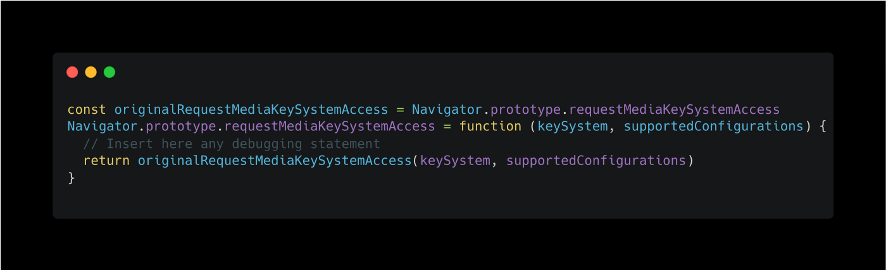
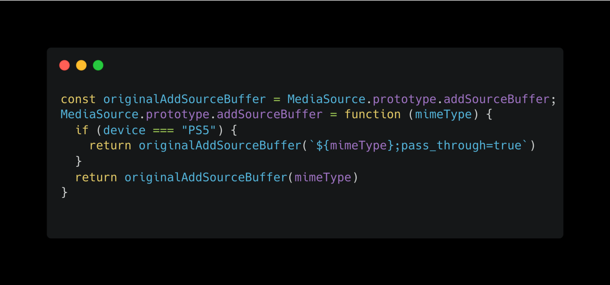

# What is monkey patching?

**The term monkey patch seems to have come from an earlier term, guerrilla patch**, which referred to changing code sneakily and possibly incompatibly with other such patches at runtime.

Indeed, monkey patching is a way to extend or modify the run time of dynamic programming languages such as javascript, python, ruby, and others.

The word guerrilla, almost homophonous with a gorilla, turned into a monkey conceivably to make the sound less scary.

## The use case when to use monkey-patching

Monkey patching is more a way for debugging, experiencing, patching, or hacking existing code than rather a long-term solution for a code base, even if it could be used as a natural solution in a few specific cases. I’m using mainly monkey patching to spy on the existing app codebase in the browser to know what they are doing internally. Indeed, it’s convenient to sneak and take some valuable knowledge on how other developers have thought of a potential solution.

## Example 1: Spying on built-in browser API

Let me take a recent real-world example that monkey patching helped me resolve.

At that time, I was working for a media streaming company. We were distributing videos on the web. However, it’s complex as we need to consider many criteria, including encryption.

Every streaming company is using the [EME API](https://web.dev/media-eme/). It’s an API that lives in the browser, not very well known to the broad public but very useful to interact with the underlying module that will help decipher the video content.

That leads us to one of the core components of this API: [requestMediaKeySystemAccess](https://developer.mozilla.org/en-US/docs/Web/API/Navigator/requestMediaKeySystemAccess).

We wanted to know with what arguments Netflix called that API to understand what deciphered content module they were using on the new Microsoft Edge browser.

The monkey patching solution was obvious to go!

We can then insert any debugging statement to spy on the call to that function before being called.

Here, I will describe what it does:

- We first need to save the original method `requestMediaKeySystemAccess`.
- Then, we will mutate the initial run time of the method by mutating the prototype on which the method lives.
- Finally, we are using the copy of the method by passing the correct arguments and returning them.
  One of the obvious questions we could ask is why we should save the original method before?

It’s a good question! Open your dev tools and try not to do it.

It won’t work as you are repeatedly calling, over and over again, the method you are trying to mutate. It causes an infinite loop.

Finally, remember to call it before the application calls it, or nothing will happen as the application will call the original function call before setting up the patch.

## Example 2: Patching external library call

Monkey patching can also patch some method calls of an external library you would use in your app.

Let’s take again a real-world example that I encountered in the past.

In the app I was building, I relied on an external library that was busy taking all the hard work of handling video data in the browser. It means downloading the video chunk by chunk and pushing those chunks into a buffer in the video HTML element.

However, I stumbled upon an issue that monkey patching helped me solve. Indeed, I needed the app to work on a PS5 console. The way the API related to the video element worked was not standard to the traditional spec.

So, the first thing I asked myself was if we could update the library I’m using to consider the PS5 case, but we quickly found that the library should follow the spec strictly and not deviate from it. So, we decided to go for monkey patching, so we only updated the app that needed to work on the PS5.

As stated earlier, monkey patching is usually not the way to go if you want to ship it in production, but the above example was the only way to make it work.

# Conclusion

Monkey patching can be used in dynamic programming languages that are, most of the time, high-level languages. In contrast, most other static programming languages do it during the compilation time rather than the run-time.

I also recommend [TamperMonkey](https://chrome.google.com/webstore/detail/tampermonkey/dhdgffkkebhmkfjojejmpbldmpobfkfo?hl=en), a chrome extension that permits you to run additional scripts in the scope of the page/tab you are running in your browser.

A few projects like [Mirage](https://github.com/pretenderjs/pretender/blob/a6d53af7d5d16c3b68670a00aa2b0706a09b6ae6/src/pretender.ts#L113) use the monkey patching style to patch any fetch or `XMLHTTPRequest` to intercept any request on the fly and redirect it toward another logic.

I hope you liked that post.

Thank you for reading, and don’t hesitate to provide any feedback.

Thanks!
