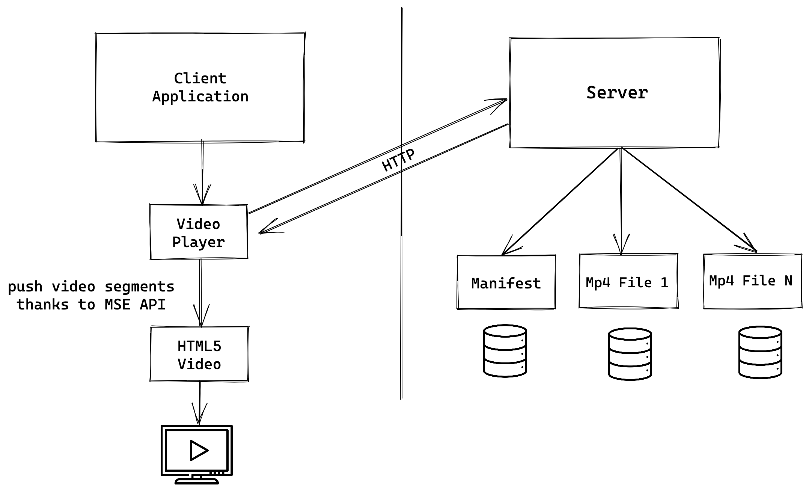

## The Streaming universe

The streaming universe is booming nowadays.

Many influential companies put millions of dollars into creating new TV shows. This unique ecosystem contributed to the growth of a few businesses. Tech is one of them.

The process of distributing video on the web is costly, and the way we stream video on the web is different from a decade ago.

Indeed, back in the day, the web relied on external plugins plugged into the web browser to play videos. Introducing Microsoft Silverlight (2007) and Adobe Flash Player (1996).

They were the solution to play videos on the web, but they quickly dashed into trouble cause of many security issues in their source code that attackers have leveraged.

Furthermore, due to the growing demand for video content on the web, the former solution began to show technical limitations.

As a result, the W3C wrote a new specification in January 2013 to address these challenges.

This specification aims to be incorporated into the HTML5 specification; this new standard is named Media Source Extensions (MSE). It comes with byte streams and video/audio codecs supported on the web browsers through the video and audio HTML5 tag.

Youtube was one of the first video pioneers to make use of MSE in September 2013.

## The MSE advantage

Carrying video data on the web is challenging.

Have you ever tried to share a big video file on the internet? Not many free and reliable solution exists, as storing big data is generally very costly, but it's also not very convenient to download.

You may have already understood, but requesting a whole movie of more than 1.5GB on the web browser is not very efficient.

That's when byte streams begin to take shape. MSE and HTTP form a great couple when it comes to downloading part of a file. Indeed, few streaming standards have emerged, like Microsoft Smooth Streaming, DASH, or HLS, to propose a solution that would leverage those two APIs to make the transport of video content on the web much more efficient as it used to be.
Those standards permit requesting a small chunk of video data, most of the time, 2secs of a movie at a time T.

That technique is very efficient because you don't have to download the whole film but rather only download what you really consume. There is no point in downloading complete movie data when you want to watch 5 minutes of the movie.

Here is a small schema explaining the process that most streaming companies use to transport video data to your house.



# How it works

Based on the schema above, we can see that the server stores the various pieces the client needs to play the video.

On the one hand, we have the video segments, which are small chunks of video from the entire movie, and they are usually 2 seconds long. If we merge those 2 seconds chunks, we will have a result for the whole video.

On the other hand, we have the manifest; it's our guide; it tells us where to find the video data on the server at which location but also what data is available. For instance, it could mean in which quality the video is available or what audio or subtitle (Languages) tracks are available.

The manifests file follows different possible standards, the most common standards are the [DASH](https://dashif.org/docs/DASH-IF-IOP-v4.3.pdf) and [HLS](https://developer.apple.com/streaming/) standards.

You can see in this following address what the form of the manifest could take depending on the standard it adopts:

- [mediahelper.io](https://mediahelper.vercel.app/manifest)

It's then the role of the application, depending on the user's choice and internet conditions to decide what to download.

For instance, downloading 4K video segments could not be the best choice if the user's internet access is limited, as 4K video segments are the heaviest.

The video player layer is responsible for requesting video segments on the server under the form of ArrayBuffer, a Javascript type used to represent raw binary data.

Nowadays, manipulating binary data on the front-end is not very common, but this is where MSE comes into play.

# The MSE API

## `<video/>` Element


The magic happens in the [<video/> HTML5 element](https://www.w3.org/TR/2011/WD-html5-20110113/video.html#attr-media-src). Many developers know that we have to specify a media element to the `src` attribute like so:

```
<video src="https://myvideo.com/birthday.mp4" />
```

But a few know that we can pass an URL that is directly linked to an object that lives in memory.

We achieve that thanks to the API: `URL.createObjectURL(...)`.

The URL will look like what we have below:

```
const video = document.querySelector('video');
video.src = URL.createObjectURL(...);
// src="blob:https://www.youtube.com/8d195e98-26d6-4f01-8251-f1d1fabc2634"
```

## Media Source

Now that we know that we can create a URL directly linked to an object, we will leverage the MediaSource API to create a `MediaSource` object connected to the `<video/>` element.

```
const mediaSource = new MediaSource();
video.src = URL.createObjectURL(mediaSource);
```

Until here, everything works fine, but nothing will happen as the MediaSource object created is not filled with anything. It is empty. We need to add video data.

This is when the `SourceBuffer` object is used.

## SourceBuffer

The `SourceBuffer` object acts like an actual buffer. It's a small object used to store data in it and could be represented like so:


We will store those 2-sec video segments we discussed earlier in this buffer.

On the MediaSource instance, few methods live on it. One of them is `addSourceBuffer`. This is the method that will create and add a `SourceBuffer` object to the `MediaSource`

```
const mimeCodec = 'video/mp4; codecs="avc1.42E01E, mp4a.40.2"';
const bufferVideo = mediaSource.addSourceBuffer(mimeCodec);
```

The `addSourceBuffer` methods take a single parameter that needs to be specified to tell the `SourceBuffer` the kind of data we will insert in the buffer.

In the video world, we compress and decompress video to transport it through the internet to gain in size as we would do with a big file that we will Zip to make it easier to transport.

It exists multiple types of compression algorithm out there, but the most knowledgeable in the industry are H264 (Advanced Video encoding) and his evolution H265 (High-Efficiency Video Coding). H265 compresses two times better for the same quality as H264. The decoding usually happens on the hardware side of the client (PC, Smartphone, Console…) you use to play the video. As H265 is relatively new on the market, still many hardware materials do not support this codec.

The MSE API provides a way to know if the codec you want to use is available given your current hardware configuration.

```
MediaSource.isTypeSupported(mimeCodec); // true or false
```

Here, the `mimeCodec` is essential because most of the time, you can’t push on the same `SourceBuffer` different codec type. Before adding new data from a different codec, you must first call the `changeType` method on the `SourceBuffer`.

The codec is the program we name that encodes and decodes a data stream.

Finally, once we have our `SourceBuffer` instance, we can start adding actual video segments to the buffer we just created, thanks to the `appendBuffer(buf)` method on the `SourceBuffer` instance.

```
const mimeCodec = 'video/mp4; codecs="avc1.42E01E, mp4a.40.2"';
const bufferVideo = mediaSource.addSourceBuffer(mimeCodec);
bufferVideo.appendBuffer(buf);
```

Once the `videoElement` has enough data in the buffer to start playing the video, his property [`readyState`](https://developer.mozilla.org/en-US/docs/Web/API/HTMLMediaElement/readyState#value)will be superior or equal to 3. The `videoElement` can then trigger the `play` method.

## Events

All this process of setting up those APIs is eventful. It means that most APIs calls should be called when an event has been sent to tell that the API is ready to proceed further.

For instance, when we create a `MediaSource` instance, we can’t instantaneously use it, as it will be in `[closed` state](https://developer.mozilla.org/en-US/docs/Web/API/MediaSource/readyState):

```
const mediaSource = new MediaSource();
console.log(mediaSource.readyState); // closed
```

We need to wait for the `MediaSource` to be in the **open** state.

```
mediaSource.addEventListener("sourceopen", () => {
  // The mediaSource is open and ready to receive a sourceBuffer
});
```

The `SourceBuffer` object also produces many [events](https://developer.mozilla.org/en-US/docs/Web/API/SourceBuffer#events).

## Appending real data

We now know how to append data, but how can we retrieve data that we will send to the `SourceBuffer` we just created?

We will use the `responseType` property from the `XMLHttpRequest` API that tells the browser what kind of data we are waiting back.

```
const xhr = new XMLHttpRequest();
xhr.open("get", url);
xhr.responseType = "arraybuffer";
xhr.onload = () => {
  // append the video segment to the buffer
  sourceBuffer.appendBuffer(xhr.response);
};
xhr.send();
```

We set the `responseType` to `arraybuffer`, which acts like a binary javascript representation that contains the chunk of the 2-sec video segment.

Once we request that data from the server, we can insert it inside the `SourceBuffer` object we created.

# Conclusion

Video on the web has almost always been part of the internet since 1993 and the first live streaming concert. Since then, video has gained more and more traction until reaching incredible milestones for specific companies that created their business around videos. For instance, in 2018, [according to research from bandwidth management company Sandvine](https://www.bbc.com/news/technology-45745362?ocid=socialflow_twitter), Netflix occupied 15% of the worldwide internet traffic.
There is also the mastodon of video on the internet, which is youtube, with more than [1 billion hours of content being watched worldwide every day on Youtube](https://www.globalmediainsight.com/blog/youtube-users-statistics/).

From those success stories, the technical handling of video on the internet has gained interest. So many of those actors gathered to create new technologies of distribution to make it easier and less frustrating for users to consume video on the web.

Hence MSE has evolved to be more supported across the different browsers and platforms. This blog article acts as an introduction to how prominent actors handle video on the web. However, video is more complex than we think, as many factors should be considered.

For instance, a company-grade video client will consider handling Adaptive bitrate streaming that consists of presenting to the user the best quality possible depending on his internet debit to avoid any potential stall that will make the viewing experience frustrating.

On the other hand, most of the tv shows you are viewing on the internet are protected by a robust encryption schema to avoid being hacked and distributed illegally; hence a client application will consider handling that part as well.

Those subjects could be part of a dedicated article as they are complex and extensive.

I hope you liked that article, don’t hesitate to give feedback.
