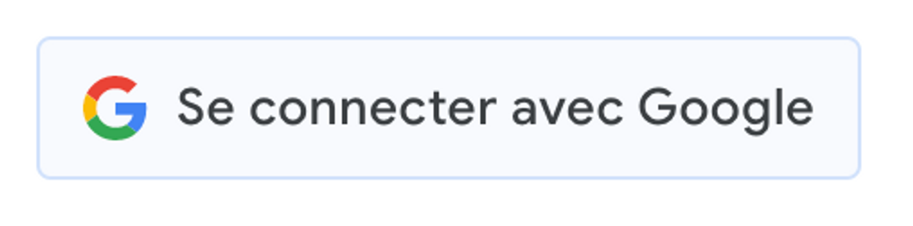
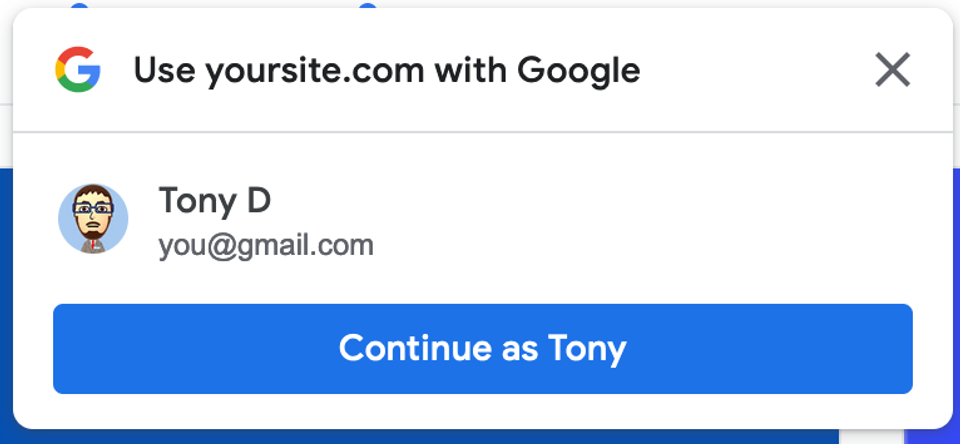

The following article is part 2 of a series of 2 blog articles that explain how to use the Google or Apple web SDK to allow users to authenticate themself into any web application.

As said in the first part of the series, authentication plays a significant and critical role in your application.

Authentification can often be very dull to implement. Still, you'll need to do it well, as your users could be potentially at risk if a security flaw allows hackers to perform wrong actions that could cause lousy buzz to your applications and could never be trusted again.

In this last series of blog posts, we will see how we can leverage the Google SDK to authenticate users into an app, and we will also see some key learnings about the process and the limits encountered.

# Google SDK

Google has recently deprecated its former API named **Google Sign-In JavaScript Platform Library for the web** in favor of a new one named **GSI** for **Google Sign-in.**

Where the former API was utterly customizable in the sense that it would fit in whatever design system, the new API makes it more complex to introduce into a rigorous design system. Indeed, Google developer allows for a controlled customization of the button used by the user to Sign-in.

It could be wrong and good news in the sense that it reduces the work to implement the button and the logic behind to implement but make it harder to make it fit into a design system.

Google is using an `iframe` element injected into the page. Since the origin of the `iframe` is different from the original origin, it's impossible to update its style or javascript.

A Google Button overview is available on this [page](https://developers.google.com/identity/gsi/web/guides/overview#sign_in_with_google_demo).



The new SDK also provides a new way to log in that allows you to log in almost seamlessly with a called [“One tap” authentication](https://developers.google.com/identity/gsi/web/guides/display-google-one-tap). You may have already encountered this authentication prompt from Google in Notion, for example:



Thus, no matter where you are in the application, you can log in from anywhere and be redirected to your personal space in the web application.

You can find Google’s recommendation about using one over the others on the [following page](https://developers.google.com/identity/gsi/web/guides/choose-components).

# SDK Loading

To use the Google SDK, we need to load it on the page to leverage Google's API.

You can get it either by inserting the following HTML element in your page's `<head/>` or, the most used way, loading the script on demand by using a custom script loader.

The second way is more efficient so that you can perform lazy loading.

- HTML based loading

```
<script
  type="text/javascript"
  src="https://accounts.google.com/gsi/client"
></script>
```

- Javascript based loading

```
await loadScript("https://accounts.google.com/gsi/client");
```

> Note that the implementation of the **`loadScript()`** function can be found in the following [gist](https://gist.github.com/PaulRosset/4f51b1206ff368f3f0cb59a7ad3e28a3).

The Google SDK is now loaded. We can now access the Google API through the `window` object on the page.

# Implementation

> ⚠️ While Google’s SDK provides two APIs, one HTML API and one Javascript API, this blog post will focus on the second one, the Javascript API.

You can find the Javascript API documentation at the following URL:

- [https://developers.google.com/identity/gsi/web/reference/js-reference](https://developers.google.com/identity/gsi/web/reference/js-reference)

## Using SDK to authenticate users

### Initialization

Google's SDK initialization can be performed anytime during your application's lifetime. Still, you have to keep in mind that we should call it before being able to use the authentication SDK.

We will invoke the `initialize()` method from Google's API:

```
window.google.accounts.id.initialize({
  client_id: "xxxx-xxxx.apps.googleusercontent.com",
  callback: handleGoogleAuth,
});
```

The above method can take several parameters as defined in the `IdConfiguration` interface defined here:

- [IdConfiguration](https://developers.google.com/identity/gsi/web/reference/js-reference#IdConfiguration)

While it contains many parameters, we will focus only on the followings ones that are the most important:

- **[`client_id`](https://developers.google.com/identity/gsi/web/reference/js-reference#client_id):** Your application's client ID is the unique identifier that will allow Google to identify your application. You can find it in the [Google credentials console](https://console.cloud.google.com/apis/credentials) by creating a new Application.
- **[`callback`](https://developers.google.com/identity/gsi/web/reference/js-reference#callback):** The callback is a javascript function that will be called when the user manages to sign in with the Google authentication provider. It allows the app to react as a consequence of a successful sign-in.

### Displaying the Google Button

Once the SDK has been initialized, we can display the Google Button that the user will use to start the authentication flow with Google. By telling Google that we want to show the Button inside a specific HTML element, Google will display a placeholder button and then the `iframe` once loaded.

```
window.google.accounts.id.renderButton(
  /** @type{!HTMLElement} */ parent,
  /** @type{!GsiButtonConfiguration} */ options
);
```

The first parameter will be an HTML element in which you want the button to be injected.

Then the second parameter would be the button configuration, primarily for design purposes.

You can find the `GsiButtonConfiguration` interface at the following URL:

- [GsiButtonConfiguration](https://developers.google.com/identity/gsi/web/reference/js-reference#GsiButtonConfiguration)

As talked earlier, the customization stays light to fit in every design system, so most of the time developer and designer would have to find a consensus to reduce as much as possible the potential shift of rendered UI.

While talking about this, two parameters came to my mind for being specifically hard to tackle as of 20 November 2022.

- [`width`](https://developers.google.com/identity/gsi/web/reference/html-reference#width): The `width` parameter may be straightforward as it’s only a Number value to pass. However, the button cannot exceed **400px.** Thus, in some design systems, it could be downright a blocker as the layout will be impacted.
- [`locale`](https://developers.google.com/identity/gsi/web/reference/html-reference#locale): This parameter is closely related to the [`text`](https://developers.google.com/identity/gsi/web/reference/html-reference#text) parameter. If your application supports more than one language, you should create a refreshing mechanism for the button to update the text inside, so users can switch from one language to the others and still be up to date with the button’s copy.

### Asking One tap authentication

We saw the first way to authenticate your users with the Google Button. We will now see how you can provide your users the “One tap” authentication experience.

After initializing the SDK, you can invoke the following method from the SDK library:

```
window.google.accounts.id.prompt(
  /** @type{(function(!PromptMomentNotification):void)=} */ momentListener
);
```

It will display the Modal on the top right corner of the screen. However, the Modal would not show consistently for the user but instead follow Google’s rules. The following URL will explain in a bit more depth how you should handle that behavior:

- [PromptMomentNotification](https://developers.google.com/identity/gsi/web/reference/js-reference#PromptMomentNotification)

It’s for Google a way to avoid any flooding implementation logic that could go against his “One tap” experience.

### Handling the success callback

During the SDK’s initialization, we specified a callback as a property of the method.

This callback will be called once the user has successfully finished his authentication flow.

We will leverage that to authenticate the user accordingly as the callback comes back with the JsonWebToken token to log in to the user inside the application.

```
function handleGoogleAuth(authInfos) {
  const jwt = authInfos.credential;
  // Send JWT to your backend to handle the authentication.
  // ...
}
```

You refer to the same interface from the following URL:

- [CredentialResponse](https://developers.google.com/identity/gsi/web/reference/js-reference#CredentialResponse)

While Apple SDK provides a way to handle errors, Google SDK cannot. However, since the flow to authenticate the user is situated in Google’s scope, we can agree that it’s not our concern as if the user enters the wrong credentials, the error will be inside Google’s responsibility.

## Experienced issues while developing

During the development, a couple of issues have been encountered.

It mainly concerned how Google SDK handles the Google Button auth and its limitation to customization.

In our case, the design system team asked for a `504`px width for the button, whereas Google Button can only be `400`px width max. We had to make choices and trade-offs.

Another issue we encountered was when we wanted to update the copy of the Google Button.

On the one hand, The text is not customizable and can only be provided by Google SDK. On the other hand, the only way to update the Google button when it has already been rendered is to remove it entirely from the DOM and render it again.

Another issue we encountered was the way Google handled the button display. It’s an `iframe` that spawns; however, it takes time to load. While it loads, an HTML-made button replaces the `iframe` element. Until then, everything is correct. However, the transition between both worlds, the main frame button, and the `iframe` present some UI glitches (Text and Size).

We can see it on the Google Documentation page at the [following address](https://developers.google.com/identity/gsi/web/guides/overview).

<video src="./video-1.mov" controls width="100%"></video>

We can see a UI glitch if you pay attention very carefully at load.

We found a workaround to avoid this glitch by applying CSS on the first button that Google displays on the main frame. To prevent that glitch, the CSS does not display the copy and sets a fixed width.

## Conclusion

Integrating social providers is pleasant, and this experience will now last.

Thanks to both articles, I wanted to share that knowledge with future developers who will integrate those solutions. I would have liked to have both pieces when I started the integration.

The different issues encountered, especially on Google's side, may disappear in the long term as Google developers will fix them, so the takeaway could not be future-proof.

Integrating a 3rd party provider of any nature permanently reserves surprises, you never know what to expect, but it's always a learning path.
